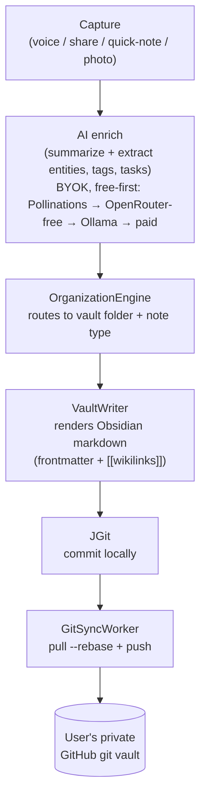

# Memoria

> A Life Memory Operating System for Android — turn voice, shares, notes, and photos into an organized, searchable, Git-backed Markdown knowledge vault, with minimal manual typing.

[](https://opensource.org/licenses/MIT)
[](https://github.com/chirag127/memoria-android/stargazers)
[](https://github.com/chirag127/memoria-android/commits)
[](https://kotlinlang.org)
[](https://github.com/chirag127/memoria-android/actions/workflows/ci.yml)
[](https://github.com/chirag127/memoria-android/releases/latest)

**Memoria is a Life Memory Operating System for Android** — a personal memory, life-capture, journaling, and knowledge-extraction system that transforms your activity into an organized, searchable knowledge vault with minimal manual typing.

Not a journaling app. Not a note-taking app. A life memory OS.

**Links:** [Repo](https://github.com/chirag127/memoria-android) · [Landing page](https://chirag127.github.io/memoria-android/) · [📱 Download the latest APK →](https://github.com/chirag127/memoria-android/releases/latest) (sideload directly — enable "install unknown apps").

⭐ **If this is useful, please [star the repo](https://github.com/chirag127/memoria-android/stargazers)** — it helps other people find it.

## Source of truth

Your **private GitHub repo of Markdown + YAML frontmatter** (an Obsidian vault). No proprietary storage, no vendor lock-in. The app writes markdown and commits+pushes directly (JGit, on-device). Markdown is canonical; Git is canonical.

## How it works



## Principles

- **Minimal typing** — voice, share sheet, and automation first.
- **Local-first, private** — captures write locally, sync is eventual; AI runs on-device calling providers directly (BYOK, free-first: Pollinations → OpenRouter-free → Ollama → paid).
- **Realistic on Android** — MVP uses only sanctioned, zero-special-access captures. Policy-restricted sources (notification/accessibility) ship only in the `full` (F-Droid/sideload) flavor.
- **Yours forever** — MIT-licensed, git-native vault outlives the app.

## Tech stack

- **Kotlin**, **Gradle** (JDK 17, `compileSdk 35`); convention plugins in `build-logic/`.
- Multi-module: `app`, `core:*`, `data:*`, `domain`, `feature:*`.
- **JGit** for on-device commit/push; **WorkManager** (`GitSyncWorker`) for background sync.
- On-device AI provider abstraction with BYOK, free-first failover.

## Repo structure

```
app/            # Android application module
core/           # common, model, ui, testing, database, datastore, security
domain/         # OrganizationEngine + domain logic
data/           # vault (VaultWriter), git (JGit), ai (providers), repository
feature/        # capture, timeline, search, settings
build-logic/    # Gradle convention plugins
docs/           # vault-schema, ai-providers, permission-matrix
```

## Build

```bash
./gradlew assembleDebug        # build
./gradlew testDebugUnitTest    # unit tests
./gradlew ktlintCheck detekt   # static analysis
```

Requires JDK 17, Android SDK (compileSdk 35). Convention plugins live in `build-logic/`.

## Configuration

**No environment variables and no secrets live in this repo.** AI is
BYOK (bring your own key) — you enter provider API keys in-app at
runtime, stored on-device. The free-first providers (Pollinations,
OpenRouter-free, Ollama) work with no key at all.

## Docs

- [`ARCHITECTURE.md`](ARCHITECTURE.md) — modules, JGit pipeline, DI
- [`docs/vault-schema.md`](docs/vault-schema.md) — folder structure + frontmatter
- [`docs/ai-providers.md`](docs/ai-providers.md) — provider abstraction + failover
- [`docs/permission-matrix.md`](docs/permission-matrix.md) — Android permissions + Play-policy risk
- [`ROADMAP.md`](ROADMAP.md) — MVP → V3 → 10-year

## Part of the oriz family

One of ~80 [oriz](https://blog.oriz.in) projects — small, sharp,
open-source tools.

## Contributing

PRs welcome. Conventional commits are the changelog.

## Status

**WIP / MVP** — see [`ROADMAP.md`](ROADMAP.md) for the MVP → V3 →
10-year plan.

## License

MIT © 2026 Chirag Singhal · chirag@oriz.in
